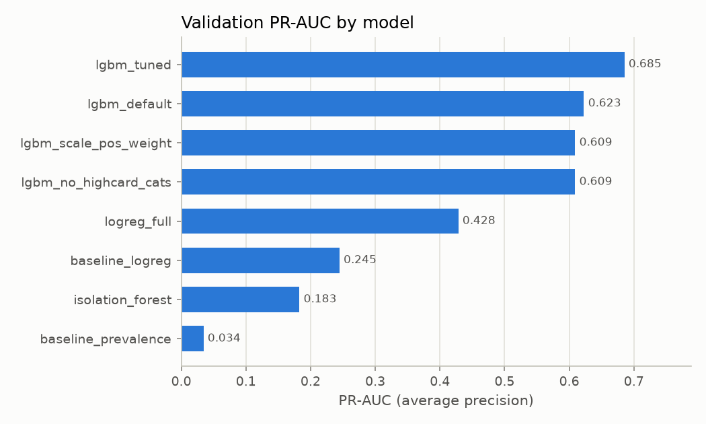
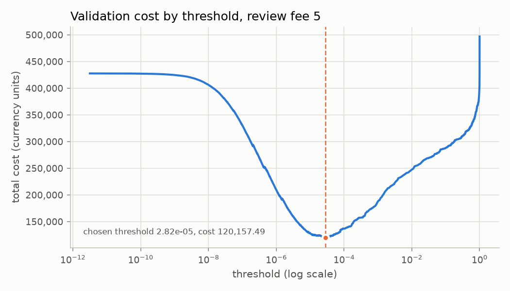
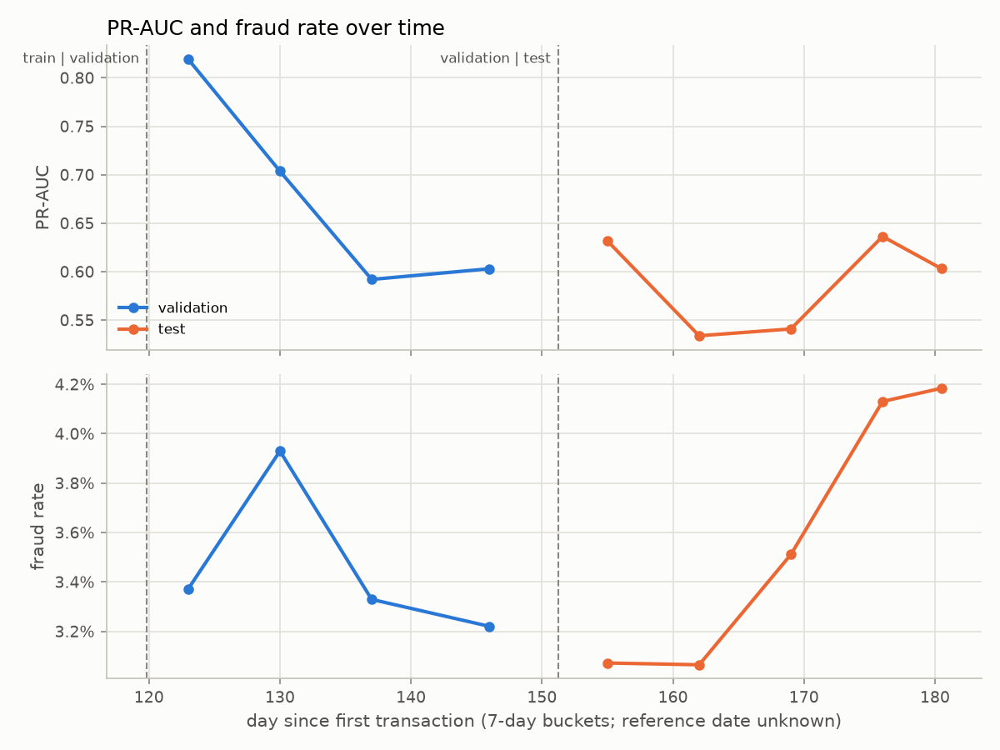
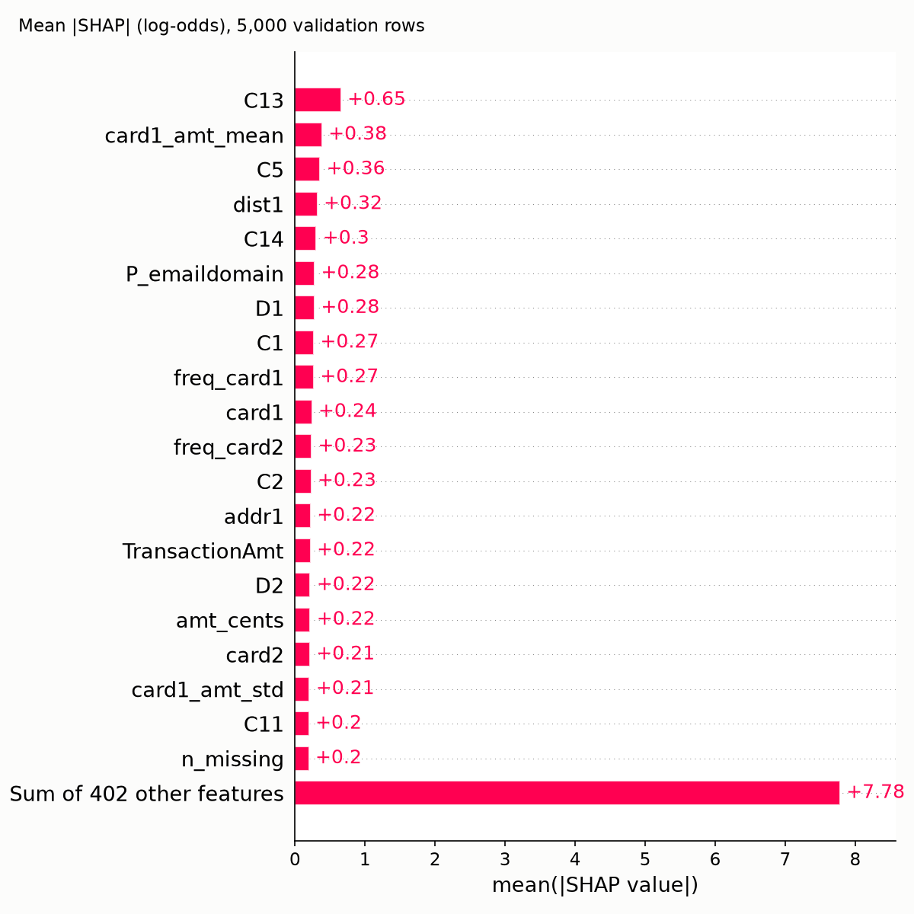

# Payments Fraud Detection

This project builds a fraud detection model for card-not-present payments and evaluates it on the latest 15% of the data by time, which no development step looked at. On that held-out test window the tuned LightGBM model reaches a PR-AUC of 0.5879 (95% bootstrap interval 0.5673 to 0.6020), against a fraud rate of 3.48%, which is the PR-AUC a random ranking would score.

## Data

The data is the IEEE-CIS Fraud Detection dataset from Kaggle: 590,540 labelled transactions, of which 3.50% are fraud, spanning 182 days. Most columns are anonymised by the data provider (the C, D, M, V and id groups) and are referred to by name only in this repository.

The raw data is not redistributed. To reproduce the results, join the Kaggle competition, accept its rules, download `train_transaction.csv` and `train_identity.csv` into `data/raw/`, then run `make data`.

## Approach

**Chronological split.** Rows are split by `TransactionDT` at its 70th and 85th percentiles into train, validation and test windows, with no shuffling. The daily fraud rate drifts over the 182 days (see `reports/eda_summary.md`), so a random split would mix future and past and overstate performance.

| window | rows | frauds | fraud rate |
| --- | --- | --- | --- |
| train | 413,378 | 14,538 | 3.52% |
| validation | 88,581 | 3,042 | 3.43% |
| test | 88,581 | 3,083 | 3.48% |

**Leakage controls.** Every fitted statistic comes from the train window only: frequency encodings, card-level amount aggregates, category levels and the list of dropped columns. `TransactionDT`, any day index and `TransactionID` never reach the model; time enters only as hour of day and day of week. The feature builder turns 432 raw input columns into 422 model features, 22 of them engineered (`reports/feature_report.md`).

**Models.** All models are fitted on train and compared on validation: a constant prevalence score, two logistic regressions, an unsupervised IsolationForest, and four LightGBM variants (default, with `scale_pos_weight`, without native handling of high-cardinality categoricals, and tuned with 40 Optuna trials). The final model is chosen by validation PR-AUC.

**Metric.** The primary metric is PR-AUC (average precision). With a fraud rate of 3.50%, a model that flags nothing is correct on every legitimate transaction and so scores a high accuracy while catching no fraud, so accuracy says little. PR-AUC measures how well frauds are ranked above legitimate transactions. Recall at a precision of 0.50 and 0.80 is also reported.

**Test set used once.** The test window is loaded in one place only, `src/fraud/final_eval.py`. The script refuses to run a second time unless `--force` is passed, and records the number of runs in `reports/metrics.json`. The final test evaluation was run once.

## Results

### Validation (development figures)

| model | PR-AUC | ROC-AUC | recall at precision 0.50 | recall at precision 0.80 |
| --- | --- | --- | --- | --- |
| prevalence baseline | 0.0343 | 0.5000 | 0.0000 | 0.0000 |
| logistic regression, amount, C and selected D columns | 0.2446 | 0.7494 | 0.1519 | 0.1088 |
| logistic regression, full feature set | 0.4284 | 0.8457 | 0.3708 | 0.2321 |
| IsolationForest (unsupervised) | 0.1827 | 0.7717 | 0.0533 | 0.0000 |
| LightGBM, default | 0.6227 | 0.9187 | 0.6302 | 0.4629 |
| LightGBM, `scale_pos_weight` | 0.6091 | 0.9071 | 0.6022 | 0.4757 |
| LightGBM, no high-cardinality categoricals | 0.6091 | 0.9226 | 0.6114 | 0.4392 |
| LightGBM, tuned (final model) | 0.6853 | 0.9294 | 0.7104 | 0.5414 |



These validation figures are optimistic. The validation window was used for early stopping, model choice, Optuna tuning and threshold selection, so it cannot give an unbiased estimate.

### Test (final, evaluated once)

| metric | validation | test |
| --- | --- | --- |
| PR-AUC | 0.6853 | 0.5879 |
| ROC-AUC | 0.9294 | 0.9084 |
| recall at precision 0.50 | 0.7104 | 0.5858 |
| recall at precision 0.80 | 0.5414 | 0.4307 |

The test PR-AUC has a 95% bootstrap interval of 0.5673 to 0.6020 (200 resamples). The validation to test gap in PR-AUC is 0.0974, and the validation value lies outside the test interval.

## Cost analysis

The decision threshold is chosen by cost on validation, under illustrative assumptions that are not real business figures:

- a missed fraud costs its transaction amount (a simplified chargeback loss);
- a false alarm costs a fixed review fee of 5 currency units;
- a flagged fraud is blocked at no further cost.

At a fee of 5 the cost-minimising threshold on validation is 2.82e-05 (transactions with a score at or above it are flagged). Applied unchanged to the test window, with the threshold for each fee chosen on validation:

| review fee | threshold | test cost of chosen policy | flag nothing | flag everything |
| --- | --- | --- | --- | --- |
| 2 | 8.62e-06 | 107,071.76 | 469,608.11 | 170,996.00 |
| 5 | 2.82e-05 | 157,683.13 | 469,608.11 | 427,490.00 |
| 10 | 6.51e-05 | 190,677.40 | 469,608.11 | 854,980.00 |



Any saving shown here depends entirely on these assumptions. With a different loss per missed fraud or a different review cost, the threshold and the saving change. Full tables are in `reports/cost_analysis.md`.

## Findings

The full findings, with sources for every number, are in `reports/findings.md`.

1. **Drivers.** On 5,000 validation rows, the features with the largest mean absolute SHAP value are C13 (0.654), card1_amt_mean (0.384), C5 (0.356), dist1 (0.317) and C14 (0.303). Card columns and card-level aggregates feature prominently. Hypothesis: the model partly recognises card-level patterns from the training window; this is not tested.
2. **Where the model fails.** At the chosen threshold on validation, ProductCD W misses 25.0% of its 1,485 frauds, against 5.0% for ProductCD R. Transactions without identity data have a false negative rate of 24.9%, against 8.4% with identity data. False alarms run the other way: 18.2% of legitimate transactions with identity data are flagged, against 8.1% without. Hypothesis: the ProductCD W and missing-identity gaps may largely be the same rows; the overlap is not measured.
3. **Performance over time.** Validation PR-AUC falls from 0.819 in the first 7-day bucket to 0.603 in the last. Test buckets range from 0.534 to 0.636 with no steady decline. Hypothesis: both drift and validation optimism may contribute to the validation to test gap, and the data does not clearly favour one over the other.





## Limitations

- **Anonymised features.** Most strong features are anonymised, so their behaviour can be described but not interpreted.
- **One snapshot, one split.** The results come from a single competition dataset and a single chronological split. There is no repeated or rolling evaluation.
- **Validation reuse.** Validation was used for early stopping, tuning and threshold choice, so validation figures are optimistic.
- **Illustrative costs.** The cost assumptions are illustrative, and the cost analysis inherits them.
- **Uncalibrated scores.** The model score is not a calibrated probability. The threshold (2.82e-05) is on the raw score scale.
- **Flag volume.** At the chosen threshold the model flags 12.3% of validation transactions at a precision of 23.3%, and 13.7% of test transactions at a precision of 19.8% (`reports/explain_summary.json`). Most flagged transactions are legitimate, which the review-fee assumption accepts but a real review team may not.
- **API inputs.** The API depends on raw columns being supplied. With only the core fields, most model inputs are missing and scores are less reliable.
- **Demonstration only.** The service has no authentication, monitoring, drift detection or retraining.

## Project structure

Tracked files only. `data/` and `models/` are created locally and are not tracked.

```text
.
├── Dockerfile, .dockerignore, Makefile, pytest.ini, .python-version
├── requirements.txt            development and training
├── requirements-serve.txt      serving image only
├── app/main.py                 FastAPI service
├── src/fraud/
│   ├── config.py               paths, seed, split fractions, cost assumptions
│   ├── data.py                 load, merge and downcast the raw CSVs
│   ├── eda.py                  exploratory analysis
│   ├── split.py                chronological split
│   ├── features.py             FeatureBuilder (fitted on train only)
│   ├── metrics.py              PR-AUC, ROC-AUC, recall at precision
│   ├── train.py                baselines and model comparison
│   ├── threshold.py            cost-based threshold on validation
│   ├── final_eval.py           one-time test evaluation
│   ├── explain.py, findings.py SHAP, error analysis, stability, findings
│   └── payload.py              API request bodies from raw rows
├── scripts/check_readme_numbers.py
├── tests/                      pytest suite
└── reports/                    metrics, tables, findings and figures
```

## Reproducing

The project uses Python 3.13 (`.python-version`). `make setup` creates the virtual environment with the `python3.13` found on the `PATH`.

On macOS, LightGBM needs the OpenMP runtime, which its wheel does not include. Install it with `brew install libomp` before running `make features` or later steps; without it, importing LightGBM fails with `Library not loaded: @rpath/libomp.dylib`. Some Python distributions, such as Miniconda, already provide it. The Docker image installs the Linux equivalent, `libgomp1`.

```bash
make setup            # create .venv and install requirements.txt
# place train_transaction.csv and train_identity.csv in data/raw/
make data             # merge and save data/interim/train_merged.parquet
make eda              # figures and reports/eda_summary.md
make split            # reports/split_info.json
make baselines        # prevalence and logistic regression baselines
make features         # FeatureBuilder, feature parquets, leakage check
make models           # model comparison, Optuna tuning, final model
make threshold        # cost-based threshold on validation
make final-eval       # one-time test evaluation
make explain          # SHAP, error analysis, stability, findings.md
make test             # pytest
```

`make models` is the slow step because of the Optuna tuning. On the development machine the 40 trials took 9,358.8 seconds of training in total, and the other models took between 19.1 seconds (IsolationForest) and 289.6 seconds (the refit of the tuned model), as recorded in `reports/metrics.json`. No other step has a recorded runtime.

`make final-eval` refuses to run when `reports/metrics.json` already contains a `final_test` entry. Passing `--force` overrides this, and doing so means the test set has been used more than once.

`models/` and `data/` are not tracked, so `make features`, `make models` and `make threshold` must be run before the API or the Docker image can be used.

## API

Run locally on port 8000:

```bash
make serve
```

Or build and run the Docker image (after `make models` and `make threshold`):

```bash
make docker-build
make docker-run
```

`GET /health` returns the status, a short model version (the first 12 characters of the SHA-256 of `models/final_model.txt`) and the threshold. `POST /predict` takes one transaction. `TransactionAmt` is required, the other core fields are optional, and any other raw column goes under `extra`. An example with invented values:

```bash
curl -s -X POST http://127.0.0.1:8000/predict \
  -H 'Content-Type: application/json' \
  -d '{"TransactionAmt": 59.95, "ProductCD": "W", "card1": 12345, "card4": "visa",
       "P_emaildomain": "gmail.com", "extra": {"C1": 2.0, "C13": 3.0, "D1": 14.0}}'
```

The response contains:

- `fraud_score`: the model's output score, on the same scale as the threshold. It is not a calibrated probability.
- `threshold`: the cost-based threshold chosen on validation.
- `decision`: `flag` when the score is at or above the threshold, otherwise `allow`.
- `ignored_fields`: keys in `extra` that are not raw dataset columns.

Invalid input, such as a negative or non-numeric amount, returns 422. Scores from the core fields alone are less reliable than scores from a full set of raw columns, because the model relies heavily on the anonymised columns. `make sample-request` writes a full example body from one validation row to `data/interim/sample_payload.json`, which is not tracked.
