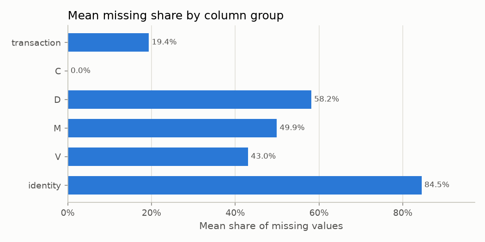
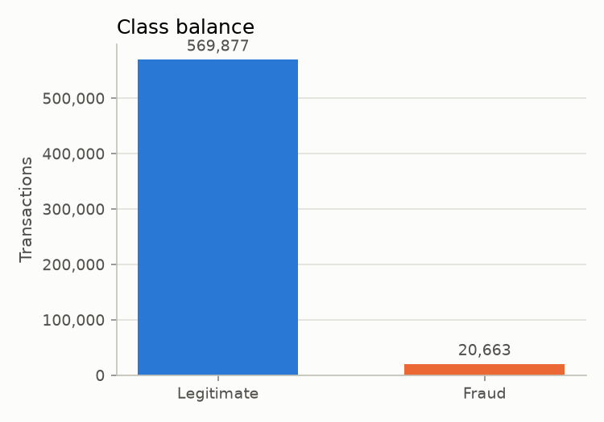
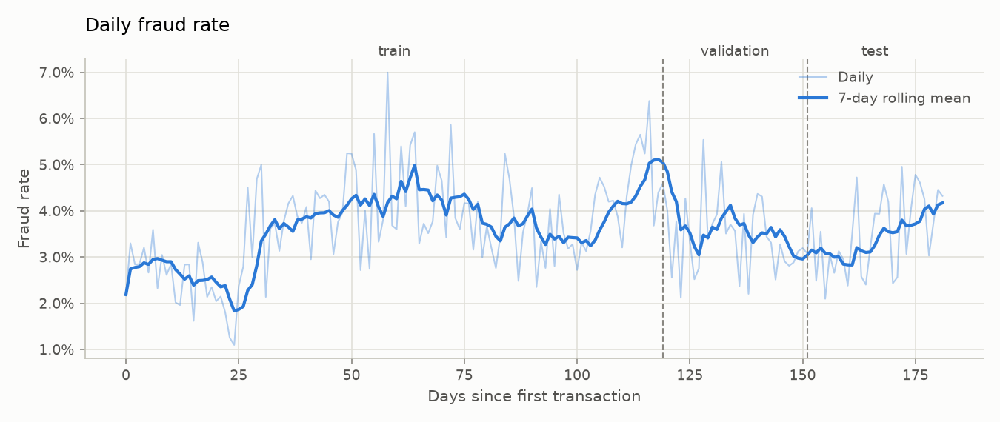
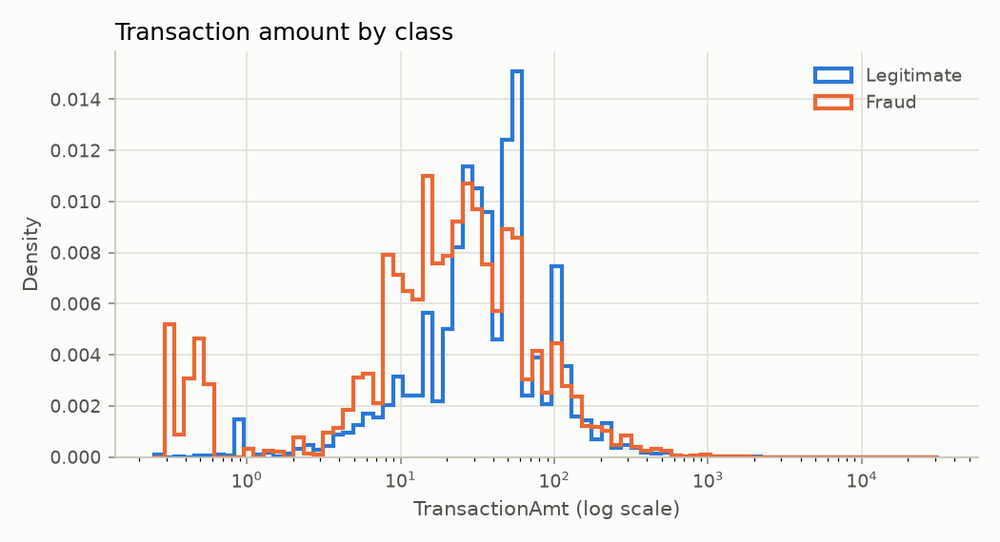
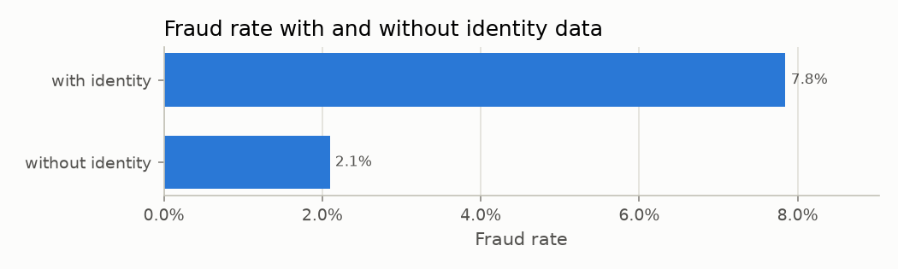
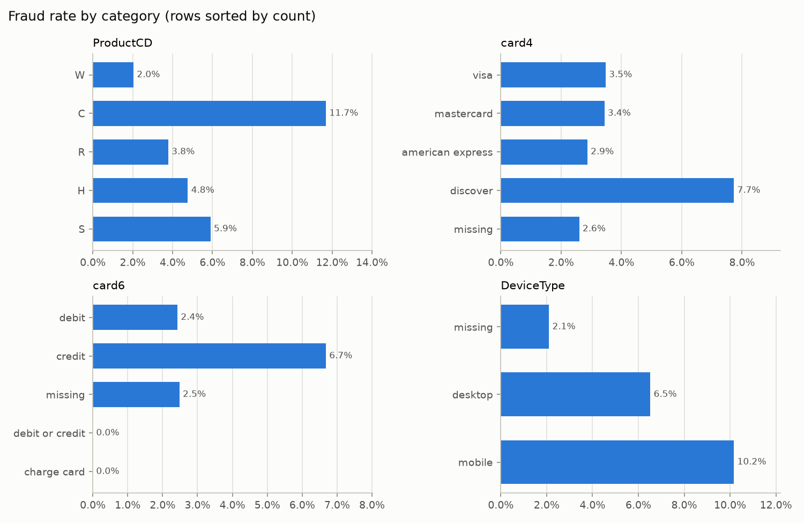
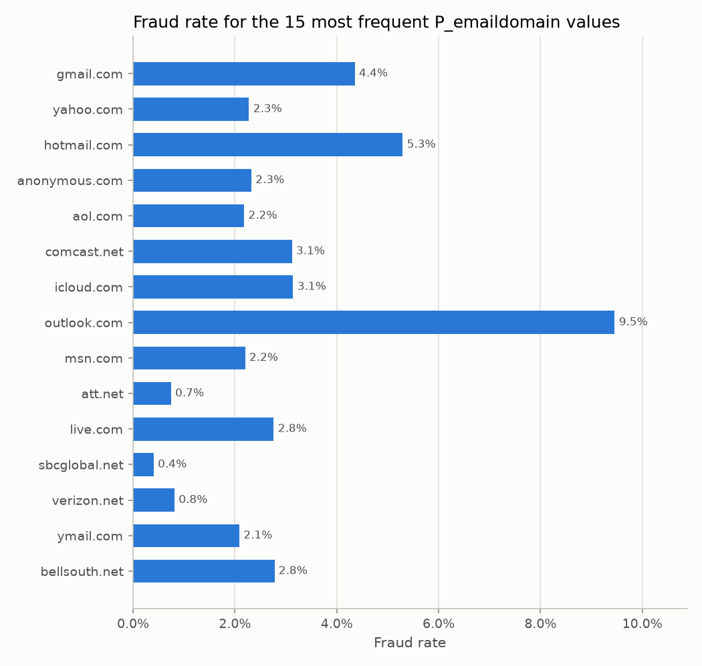

# EDA summary

Generated by `python -m fraud.eda` from `data/interim/train_merged.parquet`. Every number below is computed by the script. Anonymised columns (C, D, M, V, id) are described by name only.

## Data audit

- The merged table has 590,540 rows and 434 columns.
- TransactionID unique: True.
- TransactionDT runs from 86,400 to 15,811,131 seconds, spanning 182.0 days. Rows are sorted by TransactionDT: True.
- Constant columns: none.
- Columns more than 90% missing: 12.

### Missingness by column group

| group | columns | mean missing | fully populated | over 90% missing |
| --- | --- | --- | --- | --- |
| transaction | 14 | 19.38% | 3 | 1 |
| C | 14 | 0.00% | 14 | 0 |
| D | 15 | 58.15% | 0 | 1 |
| M | 9 | 49.92% | 0 | 0 |
| V | 339 | 43.04% | 0 | 0 |
| identity | 40 | 84.48% | 0 | 10 |

### Columns more than 90% missing

| column | missing |
| --- | --- |
| id_24 | 99.20% |
| id_25 | 99.13% |
| id_07 | 99.13% |
| id_08 | 99.13% |
| id_21 | 99.13% |
| id_26 | 99.13% |
| id_22 | 99.12% |
| id_23 | 99.12% |
| id_27 | 99.12% |
| dist2 | 93.63% |
| D7 | 93.41% |
| id_18 | 92.36% |

## 1. Class balance

20,663 of 590,540 transactions are fraud, a fraud rate of 3.50%.

## 2. Fraud rate over time

Daily buckets run from day 0 to day 181 (182 days). The daily fraud rate ranges from 1.10% (day 24) to 6.99% (day 58), with a median of 3.56%. Daily row counts range from 2,048 to 6,852. Days are relative to the first transaction because the reference date is unknown.

## 3. Transaction amount by class

| class | rows | median | mean | p25 | p75 | max |
| --- | --- | --- | --- | --- | --- | --- |
| legitimate | 569,877 | 68.50 | 134.51 | 43.97 | 120.00 | 31937.39 |
| fraud | 20,663 | 75.00 | 149.24 | 35.04 | 161.00 | 5191.00 |

## 4. Identity data

24.42% of rows have identity data.

| identity | rows | fraud rate |
| --- | --- | --- |
| with identity | 144,233 | 7.85% |
| without identity | 446,307 | 2.09% |

## 5. Fraud rate by category

### ProductCD

| ProductCD | rows | fraud rate |
| --- | --- | --- |
| W | 439,670 | 2.04% |
| C | 68,519 | 11.69% |
| R | 37,699 | 3.78% |
| H | 33,024 | 4.77% |
| S | 11,628 | 5.90% |

### card4

| card4 | rows | fraud rate |
| --- | --- | --- |
| visa | 384,767 | 3.48% |
| mastercard | 189,217 | 3.43% |
| american express | 8,328 | 2.87% |
| discover | 6,651 | 7.73% |
| missing | 1,577 | 2.60% |

### card6

| card6 | rows | fraud rate |
| --- | --- | --- |
| debit | 439,938 | 2.43% |
| credit | 148,986 | 6.68% |
| missing | 1,571 | 2.48% |
| debit or credit | 30 | 0.00% |
| charge card | 15 | 0.00% |

### DeviceType

| DeviceType | rows | fraud rate |
| --- | --- | --- |
| missing | 449,730 | 2.10% |
| desktop | 85,165 | 6.52% |
| mobile | 55,645 | 10.17% |

## 6. Top 15 P_emaildomain values (at least 500 rows)

| P_emaildomain | rows | fraud rate |
| --- | --- | --- |
| gmail.com | 228,355 | 4.35% |
| yahoo.com | 100,934 | 2.28% |
| hotmail.com | 45,250 | 5.30% |
| anonymous.com | 36,998 | 2.32% |
| aol.com | 28,289 | 2.18% |
| comcast.net | 7,888 | 3.12% |
| icloud.com | 6,267 | 3.14% |
| outlook.com | 5,096 | 9.46% |
| msn.com | 4,092 | 2.20% |
| att.net | 4,033 | 0.74% |
| live.com | 3,041 | 2.76% |
| sbcglobal.net | 2,970 | 0.40% |
| verizon.net | 2,705 | 0.81% |
| ymail.com | 2,396 | 2.09% |
| bellsouth.net | 1,909 | 2.78% |

## 7. Chronological split preview

Rows sorted by TransactionDT and cut by position at 70%, 15%, 15%. No model is trained here.

| window | rows | frauds | fraud rate | first day | last day | TransactionDT min | TransactionDT max |
| --- | --- | --- | --- | --- | --- | --- | --- |
| train | 413,378 | 14,538 | 3.52% | 0 | 119 | 86,400 | 10,437,996 |
| validation | 88,581 | 3,042 | 3.43% | 119 | 151 | 10,438,003 | 13,151,840 |
| test | 88,581 | 3,083 | 3.48% | 151 | 181 | 13,151,880 | 15,811,131 |
